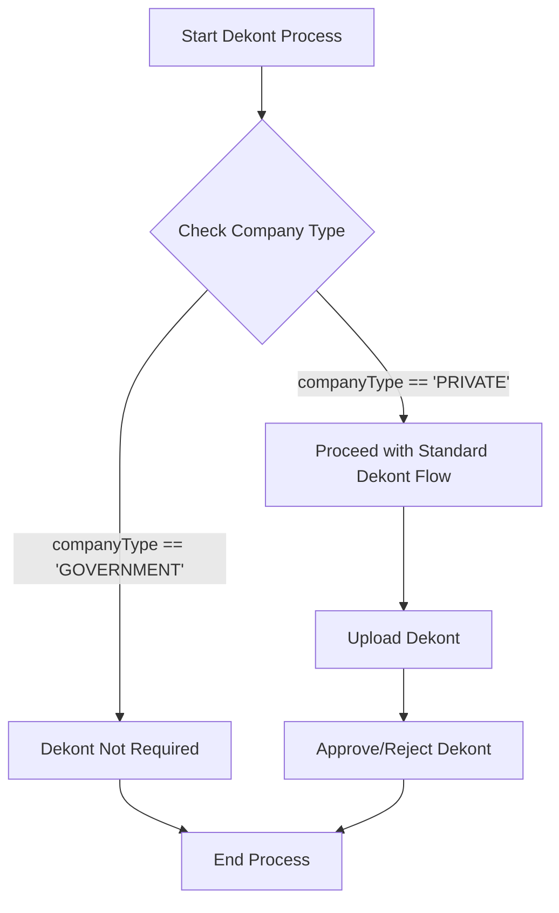

# Government Institution Support: Design Document

This document outlines the database schema changes, migration strategy, and business logic modifications required to add support for government institutions in the school dekont system.

## 1. Database Schema Changes

To accommodate government institutions, we will introduce a new field in the `CompanyProfile` model. We've chosen an `enum` for scalability.

### 1.1. `CompanyType` Enum

A new enum `CompanyType` will be added to `prisma/schema.prisma` to categorize businesses.

```prisma
enum CompanyType {
  PRIVATE
  GOVERNMENT
}
```

### 1.2. `CompanyProfile` Model Update

The `CompanyProfile` model will be updated with a new `companyType` field.

- **Field Name**: `companyType`
- **Type**: `CompanyType`
- **Default Value**: `PRIVATE` to ensure backward compatibility for all existing records.
- **Indexing**: An index will be added to this field to optimize queries filtering by company type.

Here is the proposed change in `prisma/schema.prisma`:

```prisma
model CompanyProfile {
  id                       String                     @id @default(cuid())
  name                     String
  // ... existing fields
  companyType              CompanyType                @default(PRIVATE)
  // ... existing fields

  @@index([teacherId], map: "companies_teacherId_fkey")
  @@index([companyType]) // New index for performance
  @@map("companies")
}
```

---

## 2. Migration Strategy

The migration will be handled by Prisma to ensure consistency and safety. The default value for the new `companyType` field is critical for backward compatibility.

### 2.1. Generating the Migration

A new migration will be created using the Prisma CLI. This command will compare the updated `prisma/schema.prisma` with the database schema and generate the necessary SQL migration file.

**Command:**

```bash
npx prisma migrate dev --name add_company_type
```

### 2.2. Migration File Structure

Prisma will create a new directory under `prisma/migrations/` containing a `migration.sql` file. The generated SQL will look similar to this (syntax may vary slightly between PostgreSQL and MySQL):

**For PostgreSQL:**

```sql
-- CreateEnum
CREATE TYPE "CompanyType" AS ENUM ('PRIVATE', 'GOVERNMENT');

-- AlterTable
ALTER TABLE "companies" ADD COLUMN "companyType" "CompanyType" NOT NULL DEFAULT 'PRIVATE';

-- CreateIndex
CREATE INDEX "companies_companyType_idx" ON "companies"("companyType");
```

**For MySQL:**

```sql
-- AlterTable
ALTER TABLE `companies` ADD COLUMN `companyType` ENUM('PRIVATE', 'GOVERNMENT') NOT NULL DEFAULT 'PRIVATE';

-- CreateIndex
CREATE INDEX `companies_companyType_idx` ON `companies`(`companyType`);
```

### 2.3. Backward Compatibility

By setting `DEFAULT 'PRIVATE'`, all existing records in the `companies` table will automatically be assigned the `PRIVATE` type. This ensures that the application continues to function as expected for existing businesses without any manual data intervention. No dekont-related logic will change for them.

---

## 3. Business Logic Design

The core requirement is to exempt government institutions from the dekont submission process. This will be achieved by introducing conditional logic at key points in the application.

### 3.1. Conditional Logic Flow

The primary logic is simple: **"If the company's `companyType` is `GOVERNMENT`, then skip the dekont requirement."**

Here is a Mermaid diagram illustrating the updated dekont check process:



### 3.2. Affected System Components

The conditional logic must be implemented in the following areas:

#### 3.2.1. Backend API & Data Layer

- **Dekont Creation/Validation (`/api/dekont` or similar):** Before processing a dekont upload or creation request, the API must fetch the associated `CompanyProfile` and check its `companyType`.

  - **Pseudocode:**

    ```typescript
    async function handleDekontUpload(request) {
      const { studentId, companyId } = request.body;
      const company = await prisma.companyProfile.findUnique({
        where: { id: companyId },
      });

      if (company?.companyType === "GOVERNMENT") {
        // Return a message indicating dekont is not needed
        return {
          success: true,
          message: "Government institutions do not require dekont.",
        };
      }

      // ... proceed with existing dekont upload and validation logic
    }
    ```

- **Student/Internship Data Fetching:** API endpoints that return student or internship (`Staj`) data to the frontend should include the `companyType` of the associated company. This pre-empts the need for extra lookups on the client-side.
  - **Example Prisma Query:**
    ```typescript
    const internships = await prisma.staj.findMany({
      where: { teacherId: currentTeacherId },
      include: {
        student: true,
        company: {
          select: {
            id: true,
            name: true,
            companyType: true, // Include companyType
          },
        },
      },
    });
    ```

#### 3.2.2. Teacher Interface (Frontend)

- **Dekont Upload UI (`src/app/ogretmen/dekont-yukle/page.tsx`, `src/components/ui/DekontUpload.tsx`):** The UI should conditionally render the dekont upload components. When a teacher is viewing a student whose internship is at a government institution, the upload form should be hidden or disabled.

  - **Pseudocode (React/Next.js):**

    ```jsx
    function StudentInternshipDetails({ internship }) {
      const isGovernment = internship.company.companyType === "GOVERNMENT";

      return (
        <div>
          <h2>
            {internship.student.name} at {internship.company.name}
          </h2>
          {isGovernment ? (
            <p>
              This is a government institution. Dekont submission is not
              required.
            </p>
          ) : (
            <DekontUploadComponent internshipId={internship.id} />
          )}
        </div>
      );
    }
    ```

- **Dekont Status Lists (`src/components/ui/DekontList.tsx`, `src/components/ui/OgretmenDekontListesi.tsx`):** In lists that show dekont statuses (e.g., "Pending," "Missing"), students at government institutions should be clearly marked as "Not Applicable" or filtered out from dekont-related views.

---

## 4. Admin Interface Design

To allow administrators to manage the new business categorization, the company management interface must be updated.

### 4.1. Company Edit Page

On the page where administrators edit a company's profile (likely within a component like `src/components/ui/AdminManagement.tsx` or a dedicated admin page), a new form element should be added.

- **UI Element**: A dropdown menu (HTML `<select>`) labeled "Company Type" (`İşletme Türü`).
- **Options**:
  - "Private" (`Özel Sektör`) - `PRIVATE`
  - "Government" (`Kamu Kurumu`) - `GOVERNMENT`
- **Default State**: For existing companies, it will default to "Private". For new companies, "Private" should be the pre-selected option.

### 4.2. Update Logic

- **API Endpoint**: A `PATCH` request should be sent to an endpoint like `/api/admin/companies/[companyId]` when the value is changed.
- **Request Body**: The request should contain the new `companyType`.
  ```json
  {
    "companyType": "GOVERNMENT"
  }
  ```
- **Feedback**: Upon successful update, a toast notification should confirm that the change was saved.

### 4.3. Visual Mockup

```
+----------------------------------------------------+
| Edit Company: [Company Name]                       |
+----------------------------------------------------+
|                                                    |
| Name:    [______________________________________]  |
|                                                    |
| Contact: [______________________________________]  |
|                                                    |
| ... (other fields)                                 |
|                                                    |
| Company Type: [ Private Sector      ▼ ]            |  <-- New Dropdown
|               +---------------------+              |
|               | Private Sector      |              |
|               | Government          |              |
|               +---------------------+              |
|                                                    |
| [ Save Changes ]                                   |
|                                                    |
+----------------------------------------------------+
```

---

## 5. Teacher Interface Design

The teacher interface must clearly communicate when a dekont is not required and prevent unnecessary actions. The changes will primarily affect student and dekont list views.

### 5.1. Student/Internship List View

In any list where teachers view their assigned students and their associated companies (e.g., on the main panel `src/app/ogretmen/panel/page.tsx` or within a component like `src/components/staj/OgrenciCard.tsx`), a visual indicator should be added.

- **UI Element**: A small badge or label next to the company name.
- **Text**: "Government" (`Kamu`) or "Official" (`Resmi`).
- **Example**:
  ```
  +-------------------------------------------+
  | Student: [Student Name]                   |
  | Company: [Company Name] [Government]      |  <-- New Badge
  |-------------------------------------------|
  | [ View Details ] [ Upload Dekont ]        |
  +-------------------------------------------+
  ```

### 5.2. Dekont Upload and Status Views

As detailed in the Business Logic section (3.2.2), the UI should adapt based on the company type.

- **Hiding Upload Forms**: The "Upload Dekont" button and related forms (`src/components/ui/DekontUpload.tsx`) should be conditionally hidden.
- **Displaying Informational Text**: In place of the upload form, a clear message should be displayed.
  - **Message**: "This student is completing their internship at a government institution, so dekont submission is not required." (`Bu öğrenci stajını bir kamu kurumunda yaptığı için dekont yüklenmesi gerekmemektedir.`)
- **Status Lists (`src/components/ui/DekontList.tsx`):** In tables or lists that track dekont submissions, the status for students at government institutions should be shown as "Not Applicable" (`Gerekli Değil`). This prevents them from appearing as "Missing" or "Pending."

### 5.3. Visual Mockup (Student Detail View)

```
+----------------------------------------------------+
| Internship Details: [Student Name]                 |
+----------------------------------------------------+
|                                                    |
| Company:      [Company Name]                       |
| Company Type: Government Institution               |
|                                                    |
| Dekont Status:                                     |
| +------------------------------------------------+ |
| | This is a government institution.              | |
| | Dekont submission is not required.             | |
| +------------------------------------------------+ |
|                                                    |
+----------------------------------------------------+
```
